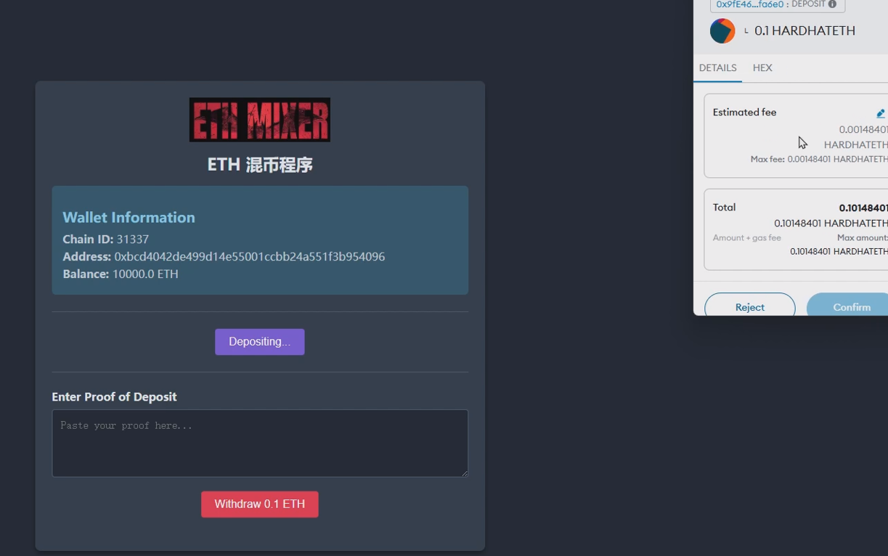
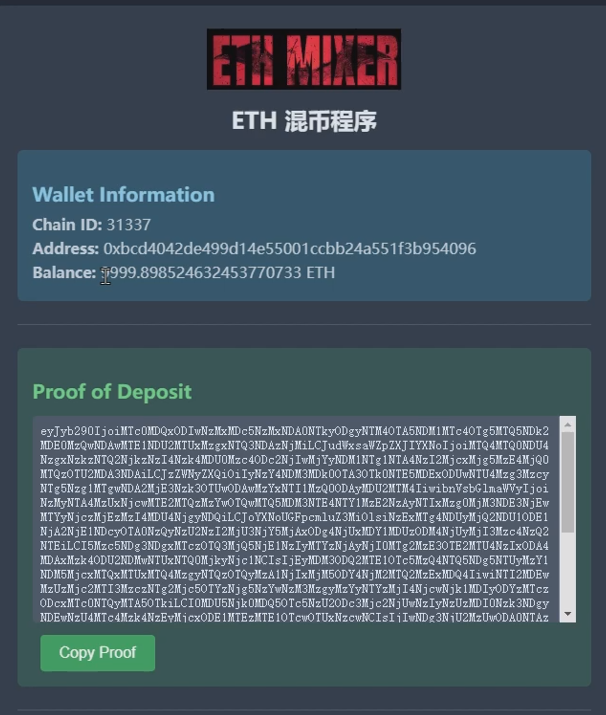
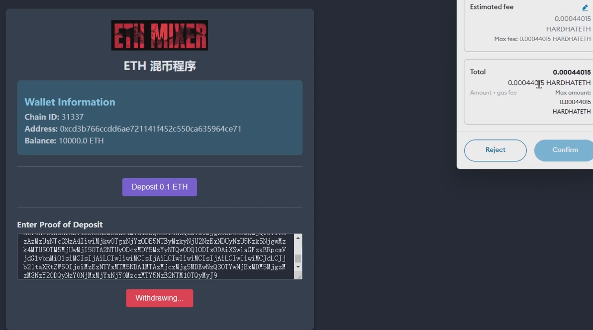

## Disclaimer

This project is provided as-is for educational and research purposes only. By using this code, you agree to the following terms:

1.Prohibited Usage:
    This code must not be used for any illegal, unethical, or malicious activities, including but not limited to hacking, unauthorized access, or any activity that violates applicable laws and regulations. Any such use is strictly prohibited.

2.User Responsibility:
    The user assumes full responsibility for the outcomes of using this code. The author(s) of this project shall not be held liable for any damage, loss, or legal consequences resulting from the use or misuse of this code.

3.No Warranty:
    This code is provided "as-is" without any express or implied warranties, including but not limited to the warranties of merchantability, fitness for a particular purpose, or non-infringement.


4.Legal Indemnification:
    The author(s) of this project explicitly disclaim any liability for the misuse of the code or its application in any unauthorized manner. Users are advised to comply with all applicable laws and regulations when using this code.


本项目旨在设计并实现一个基于零知识证明的去中心化混币器。该混币器将利用零知识证明技术以及Groth16零知识验证系统，在保护用户隐私的前提下实现加密货币的匿名交易。


## 简介

系统分为三个部分。

电路circuit 模块主要由circom编写，编译该电路生成R1CS（Rank-1 Constraint System）以及相关的js代码和solidity代码配合前后端使用，这是零知识证明系统的核心部分。

前端frontend主要实现和metamask钱包的交互。使用电路生成的js代码，在存款时构建proof elements，取款时在前端计算proof发送给后端。

后端backend配合电路验证前端发来的zk proof，并将交易信息存储在merkel tree上。


## 使用说明

以部署在hardhat本地区块链为例


### 准备阶段

零知识证明准备工作

1、创建一个仪式文件

```
snarkjs powersoftau new bn128 13 ceremony_0000.ptau -v
```

12代表最大约束数。当我们编译电路时，会给你一个输出，详细说明电路有多少约束。13代表电路可以拥有的最大约束数是2^13。

最后命名为ceremoy_0000.ptau，将数字附加到仪式词的末尾是传统做法，这样就可以跟踪哪些参与者为这个仪式文件贡献了随机性。

2、为这个仪式文件贡献随机性

将这个生成文件传递给其他实体，他们将它们选择的随机性贡献给仪式文件。贡献之后这些数字和输入应该被丢弃只需要最后的生成文件。

```
snarkjs powersoftau contribute ceremony_0000.ptau ceremony_0001.ptau
```

从其他实体那里获取到仪式文件时可以验证完整性，因为需要确保为该文件贡献随机性之前，仪式文件没有以任何方式被破坏。

验证仪式文件完整性：

```
snarkjs powersoftau verify ceremoy_0001.ptau
```

若最后一行打印出[INFO] snarkJS: Powers of Tau Ok!，则意味着仪式文件正确。

重复上述步骤

```
snarkjs powersoftau contribute ceremony_0001.ptau ceremony_0002.ptau
snarkjs powersoftau contribute ceremony_0002.ptau ceremony_0003.ptau
```

当文件随机性贡献完成后，生成最终文件：

```
snarkjs powersoftau prepare phase2 ceremoy_0002.ptau ceremoy_final.ptau -v
```

验证最后的生成文件：

```
snarkjs powersoftau verify ceremoy_final.ptau  
```

3、使用Groth16设置，将生成文件与电路交织在一起

首先，编译电路成R1CS，我们就可以给它提供仪式文件：

```
circom withdraw.circom --r1cs
```

生成密钥zkey,该文件包含用于生成证明和验证的参数：

```
snarkjs groth16 setup withdraw.r1cs ceremony_final.ptau setup_0000.zkey
```

为这个ZKey文件贡献一次额外的随机性。

```
snarkjs zkey contribute setup_0000.zkey setup_final.zkey
```

验证最后的ZKey文件：

```
snarkjs zkey verify withdraw.r1cs ceremony_final.ptau setup_final.zkey
```

生成验证合约

```
snarkjs zkey export solidityverifier setup_final.zkey Verifier.sol
```


配置完成后，可以替换项目中对应的Verifier.sol，以构建新的零知识验证系统。


### 前端

启动项目

```
npm run dev
```


### 后端

启动本地区块链

```
npx hardhat node
```


接下来就可以正常存取款


## 功能演示

### 存款



确认交易后会获得对应的proof elements，这部分将用于构造zk proof。proof elements通过安全信道发送给取款方。




### 取款

取款放输入对应的proof elements。这会在前端构造zk proof。然后将zk proof发送给后端进行取款。




取款完成后，后端会更新merkel tree。取款人无法重复取款